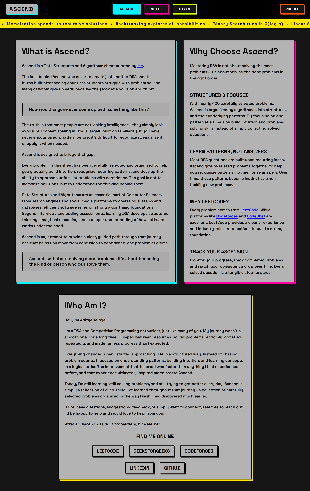
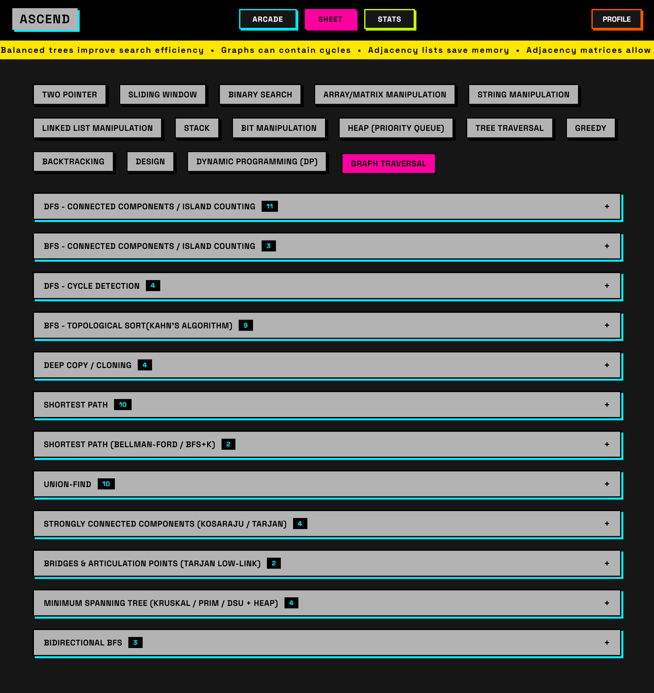
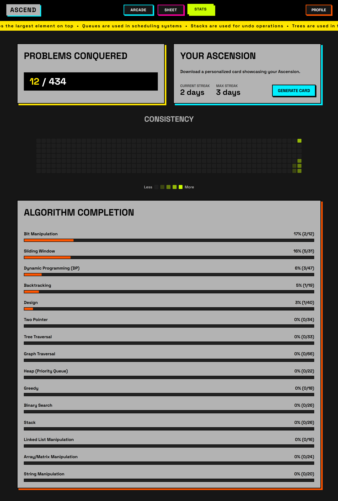
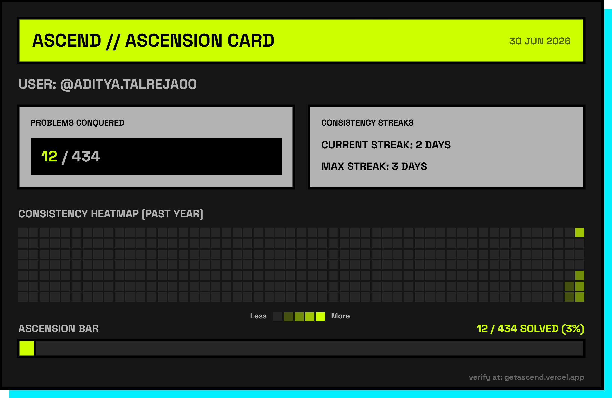

# Ascend - A Structured DSA Sheet & Progress Tracker

Ascend is a curated Data Structures and Algorithms sheet containing **434 LeetCode problems** organized across **15 algorithm categories** and **98 underlying patterns**. It is built for students who want a clear, structured path through DSA - not just another random problem list.

The idea behind Ascend came from watching countless students (myself included) struggle with problem solving. Jumping between resources, solving problems randomly, and making far less progress than expected. Most people aren't lacking intelligence - they lack exposure to patterns. Ascend is designed to bridge that gap.

> Ascend isn't about solving more problems. It's about becoming the kind of person who can solve them.

**Live:** [getascend.vercel.app](https://getascend.vercel.app)

---

## Table of Contents

- [What It Does](#what-it-does)
- [Pages](#pages)
- [Tech Stack](#tech-stack)
- [Project Structure](#project-structure)
- [How the Sheet Works](#how-the-sheet-works)
- [Algorithm Categories](#algorithm-categories)
- [Authentication & Data](#authentication--data)
- [Local Development](#local-development)
- [Contributing](#contributing)
- [Author](#author)

---

## What It Does

- Provides a hand-picked set of 434 LeetCode problems ordered by algorithm and pattern, so you build intuition instead of memorizing answers.
- Tracks your progress per problem, synced to a database so you can pick up from any device.
- Shows a stats dashboard with a GitHub-style consistency heatmap, streak tracking, and per-algorithm completion bars.
- Lets you generate and download a personalized "Ascension Card" - a PNG image summarizing your progress, streaks, and heatmap - to share or keep as a milestone.

---

## Screenshots

### Arcade


### Sheet


### Stats


### Ascension Card


---

## Pages

Ascend is a single-page application with three tabs:

### 1. Arcade
The landing page. Explains what Ascend is, why it exists, what makes it different from other sheets, and a short about-me section with social links.

### 2. Sheet
The core of the application. Displays algorithm category buttons along the top. Selecting one reveals its patterns as collapsible accordion sections. Each pattern expands into a table of problems with:
- A checkbox to mark completion
- The LeetCode problem number
- A direct link to the problem on LeetCode

Checking or unchecking a problem immediately syncs to the database (or localStorage for guests).

### 3. Stats
Requires authentication. Once logged in, this page shows:
- **Problems Conquered** - total solved out of 434
- **Current Streak / Max Streak** - consecutive days with at least one problem solved
- **Consistency Heatmap** - a full-year, day-by-day grid (370 days) showing solve activity, color-coded by intensity
- **Algorithm Completion** - progress bars for each of the 15 categories, sorted by completion percentage
- **Ascension Card Generator** - renders a high-resolution (3x scaled) PNG card on a canvas with your username, stats, heatmap, and an ascension bar. Previewed in a modal and downloadable.

---

## Tech Stack

| Layer | Technology |
|---|---|
| Markup | HTML5 |
| Styling | Vanilla CSS (Neobrutalist design) |
| Logic | Vanilla JavaScript (no frameworks, no build step) |
| Font | [Space Grotesk](https://fonts.google.com/specimen/Space+Grotesk) via Google Fonts |
| Backend/Auth | [Supabase](https://supabase.com) (Auth + PostgreSQL) |
| Hosting | [Vercel](https://vercel.com) |

No bundlers, no transpilers, no npm dependencies in the project itself. The Supabase JS client is loaded via CDN. The entire frontend is four files.

### Design Philosophy
The UI follows a **neobrutalist** aesthetic - thick borders, hard shadows, high contrast, bold typography, flat color blocks. The styling is intentionally CSS-only with no animation libraries. This keeps the site lightweight and fast while still having a distinct visual identity.

---

## Project Structure

```
Ascend/
├── index.html             # Single HTML file, all three tabs
├── style.css              # All styling, neobrutalist design system (~1840 lines)
├── script.js              # All application logic (~1400 lines)
├── supabase-client.js     # Supabase initialization, auth helpers, DB operations
├── data.json              # Problem dataset (434 problems, 15 algorithms, 98 patterns)
├── ascend_icon.png        # Favicon
└── .gitignore
```

### `data.json`

The entire problem set lives in a single JSON file, kept separate from the application logic so it can be updated or extended independently. Structure:

```json
{
  "algorithms": [
    {
      "name": "Two Pointer Patterns",
      "patterns": [
        {
          "name": "Converging",
          "problems": [
            {
              "id": 11,
              "title": "Container With Most Water",
              "link": "https://leetcode.com/problems/container-with-most-water/"
            }
          ]
        }
      ]
    }
  ]
}
```

Each problem has an `id` (the LeetCode problem number), a `title`, and a direct `link`. The hierarchy is `algorithm > pattern > problem`.

---

## How the Sheet Works

1. **Pick an algorithm** - buttons are rendered in a suggested difficulty order (Two Pointers first, Graph Traversal last).
2. **Expand a pattern** - each pattern is a collapsible section showing its problems in a table.
3. **Solve and check** - clicking the checkbox marks the problem as completed. The state is immediately:
   - Written to the Supabase `user_progress` table if authenticated
   - Saved to `localStorage` if browsing as a guest
4. **Guest-to-user merge** - if a guest signs up after solving problems locally, their progress is bulk-synced to Supabase on first login and the local cache is cleared.

---

## Algorithm Categories

| # | Category | Problems | Patterns |
|---|---|---|---|
| 1 | Two Pointer | 34 | 7 |
| 2 | Sliding Window | 31 | 4 |
| 3 | Binary Search | 26 | 5 |
| 4 | Array/Matrix Manipulation | 24 | 7 |
| 5 | String Manipulation | 20 | 7 |
| 6 | Linked List Manipulation | 16 | 5 |
| 7 | Stack | 26 | 6 |
| 8 | Bit Manipulation | 12 | 4 |
| 9 | Heap (Priority Queue) | 22 | 4 |
| 10 | Tree Traversal (DFS & BFS) | 33 | 6 |
| 11 | Greedy | 18 | 6 |
| 12 | Backtracking | 19 | 7 |
| 13 | Design | 40 | 2 |
| 14 | Dynamic Programming | 47 | 12 |
| 15 | Graph Traversal (DFS & BFS) | 66 | 12 |
| | **Total** | **434** | **98** |

---

## Authentication & Data

### Supabase Setup

Authentication is handled entirely through Supabase:

- **Email/Password** sign-up with email verification enabled. After registering, users must confirm their email before they can sign in.
- **Google OAuth** sign-in via Supabase's OAuth flow (PKCE).
- Session persistence uses `localStorage` with auto-refresh.

### Database

A single `user_progress` table in Supabase PostgreSQL:

| Column | Type | Description |
|---|---|---|
| `user_id` | UUID | Foreign key to `auth.users` |
| `problem_id` | integer | LeetCode problem number |
| `completed` | boolean | Whether the problem is solved |
| `date` | date | The local date when the problem was marked |

Progress is upserted on check and deleted on uncheck. Bulk upsert is used during guest progress migration.

### Guest Mode

Users can browse the sheet and check off problems without logging in. Progress is stored in `localStorage` under the key `ascend-checked`. When they eventually sign up and log in, all local progress is merged into Supabase in a single bulk transaction.

### Other Auth Features

- Profile dropdown with username display (email prefix)
- Logout clears session and cache
- Reset Progress with a confirmation modal (destructive, deletes all rows for the user)
- Auth state change listener that handles OAuth redirects, cleans URL hash tokens, and triggers progress reload
- Toast notifications for all auth events (success, error, email verification)
- Request timeout handling (60s) for auth operations

---

## Local Development

No build step required. Serve the files with any static server:

```bash
# Using Python
python -m http.server 8000

# Using Node
npx serve .

# Using VS Code
# Install the "Live Server" extension and click "Go Live"
```

Open `http://localhost:8000` (or whichever port your server uses).

The Supabase credentials are hardcoded in `supabase-client.js`. For local development against the existing project database, this works out of the box. To use your own Supabase instance, replace `SUPABASE_URL` and `SUPABASE_ANON_KEY` in that file and set up a `user_progress` table matching the schema above.

---

## Contributing

If you find a problem link that's broken, a pattern that should include a different problem, or have suggestions for new categories - open an issue or a pull request. The problem data is all in `data.json`, so contributions to the sheet itself don't require touching any application code.

---

## Author

**Aditya Talreja**

- [LeetCode](https://leetcode.com/u/adionlc/)
- [Codeforces](https://codeforces.com/profile/Aditya-Talreja)
- [GeeksforGeeks](https://auth.geeksforgeeks.org/user/adiongfg/)
- [LinkedIn](https://www.linkedin.com/in/adityatalreja/)
- [GitHub](https://github.com/Aditya-Talreja)

---

## License

This project is open source. If you use it or adapt it, a mention or star would be appreciated.
